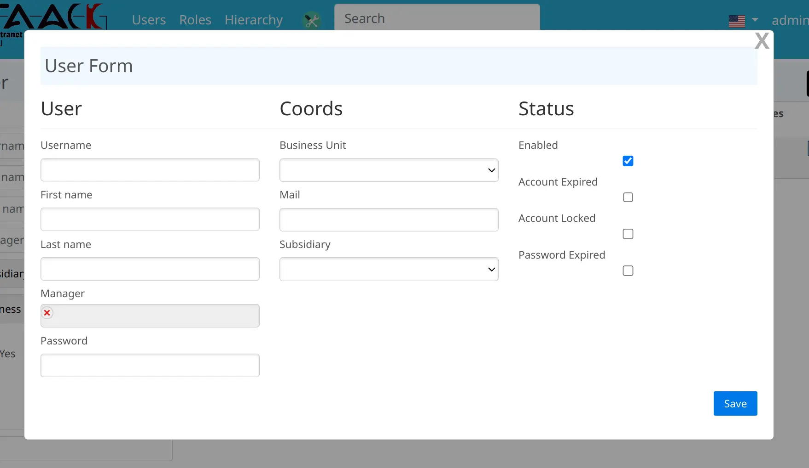

include::_settings_reveal.adoc[]
:source-highlighter: highlightjs
:highlightjs-languages: groovy, gnuplot
:title-slide-transition: zoom
:title-slide-transition-speed: fast
:icons: font
:docinfo: shared
:customcss: custom.css
:taack-height: 512

= Chinese Slides

== UI用户界面link:https://en.wikipedia.org/wiki/Domain-specific_language[*DSL*]

DSL (#Domain Specific Language / 领域特定语言#)

[transition=zoom]
=== 优势

** 更具表现力
** 静态编译
** 无需JavaScript以及HTML

[transition=concave,transition-speed=fast,transition-background=zoom]
== 表单

[%notitle,transition=zoom]
=== 表单样例

[source,groovy]
----
new UiFormSpecifier().ui user, {
    section "User", {
        field user.username_
        field user.firstName_
        field user.lastName_
        ajaxField user.manager_, this.&selectUser
        field user.password_
    }
// [ . . . ]
}
----

[%notitle]
=== 表单页面

[transition=convex,transition-speed=fast,transition-background=zoom]
== 表单验证

[%notitle]
=== 表单验证页面

[.columns]
== 图形组件

[.column]
--
** 表格
** 筛选器
** 表单
--
[.column]
--
** 数据详情
** 图表
--

== 扩展组件

** 文件预览
** 纯文本搜索
** JDBC驱动程序查询模型
