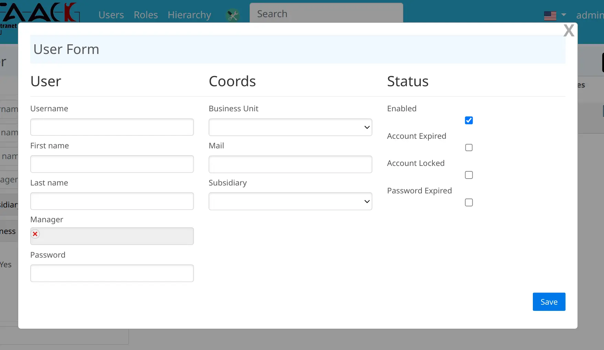

include::_settings_reveal.adoc[]
:source-highlighter: highlightjs
:highlightjs-languages: groovy, gnuplot
:title-slide-transition: zoom
:title-slide-transition-speed: fast
:icons: font
:docinfo: shared
:customcss: custom.css
:revealjs_height: 512

= French Slides

== User Interface *DSL*

DSL (#Domain Specific Language#)

[transition=zoom]
=== Advantages

** More expressive
** Static check at compile time
** No JavaScript / HTML Needed

[transition=concave,transition-speed=fast,transition-background=zoom]
== Forms

[%notitle,transition=zoom]
=== Form Sample

[source,groovy]
----
        new UiFormSpecifier().ui user, {
            hiddenField user.subsidiary_
            hiddenField user.origin_
            section "User", {
                field user.username_
                field user.firstName_
                field user.lastName_
                ajaxField user.manager_, this.&selectUserM2O
                field user.trigram_
                field user.password_
            }
        // [ . . . ]
        }
----

[%notitle]
=== Forms

[.columns]
== Graphical Components

[.column]
--
** Table
** Filter
** Form
--
[.column]
--
** Show
** Charts
--

== Extend components

** File Previews
** Full Text Search
** JDBC driver to Query Model
